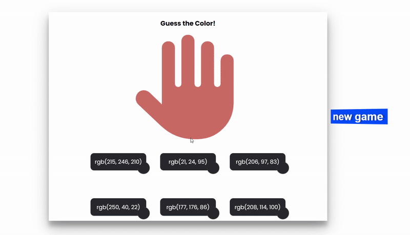

# 🎨 Color Guess Game

A fun and interactive color guessing game built with **HTML, CSS, and JavaScript**. Guess the color displayed on the hand by clicking the correct button!

 <!-- Replace this with your GIF -->

## 🕹️ How to Play

1. A random color is displayed on the hand icon.  
2. Several buttons show different colors.  
3. Click the button that matches the hand's color.  
4. Feedback:  
   - ✅ Correct: background turns **green**, the button changes to the target color, and "Very good" appears.  
   - ❌ Wrong: background turns **red**, the button turns red, and "Try again" appears.  
5. Click **"New Game"** to reset and generate a new target color.

## 💻 Installation

Clone the repository:

```bash
git clone https://github.com/nazavarzohre7713/colorGame-js.git
```
Navigate into the project folder:
cd colorGame-js
Open index.html in your browser to play the game.

🎨 Features

Random color generation

Interactive buttons with hover and click effects

Instant feedback for correct/wrong answers

Reset button to start a new game

Modern and clean glass-style design

Fully responsive layout

🛠️ Technologies Used

HTML5

CSS3

JavaScript (Vanilla)

Font Awesome Icons

🔗 Live Demo

Host locally or on GitHub Pages to try it online.

❤️ Author

Made with 💜 by Nazavarzohre

Enjoy guessing the colors and improving your reaction speed!
